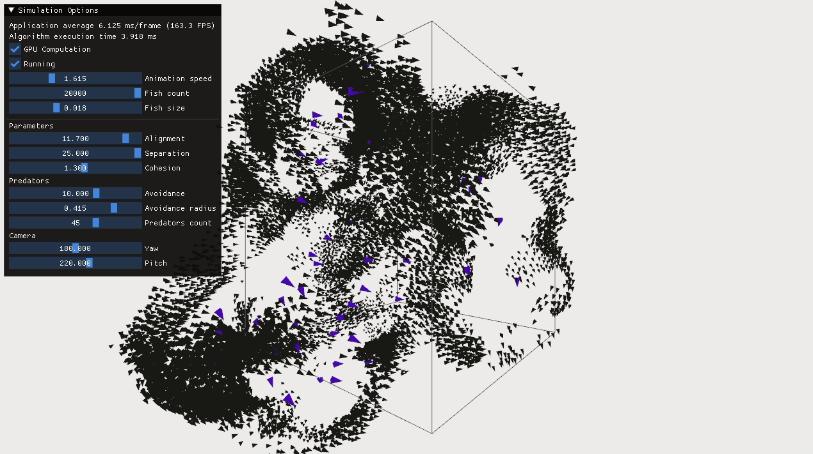

# Parallel fish boids



Preview of parallel [boids](https://en.wikipedia.org/wiki/Boids) algorithm simulation with 20k fishes.

## Description

This project contains the source code for basic 3D simulation of the flocking behaviour of fishes. Two types of fishes are present: 
- default fishes (which act according to the classical steer rules but with additional predator avoidance),
- predators (which move almost the same as default fishes but are avoided by non-predator fishes).

Implementation was based on [Craig Reynolds's article](http://www.red3d.com/cwr/boids/) and [@TortillaZHawaii's](https://github.com/TortillaZHawaii/fishes_cuda) repo.

## Dependencies

Following dependencies were used in this project:

* CUDA SDK 10.1
* OpenGL 4.6.0
* GNU Make 4.2.1
* Imgui 1.87

## Build and Run
### Linux
Change the current directory to the sample directory you wish to build, and run make:
```
$ cd fish-boids-parallel
$ make
```
After succesfull compilation you should be able to run the program by simply calling:
```
$ ./boids
```
By default program will run a prallel simulation of flocking behaviour with 10k fishes and default simulatin parameters. While the simulation is running you are able to change few paremeters within defined range. 
It is possible to execute algorithm purely on CPU. In order to do so you need to uncheck `GPU Computation` checkbox. For the performace's sake computation on CPU is limited to process 1k fishes maximum.
